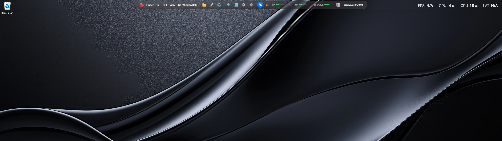
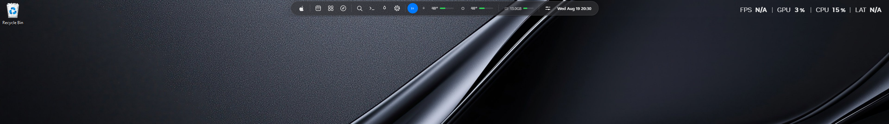

# Anti-AI-Slop UI Design

A design skill for AI coding agents: produce interfaces that feel intentionally designed by a competent product designer, not generated from common AI frontend patterns.

Works with opencode (native skill), Claude Code, Codex, and any agent platform that supports `SKILL.md` skills.

## What It Does

Stops agents from defaulting to the generic AI aesthetic — purple gradients, glassmorphism, bento grids, Inter/Geist, "supercharge your workflow" copy. Instead, the visual language derives from the actual product, audience, content, and use case.

Covers:

- Visual direction & identity (typography, colour logic, spacing, corners, density)
- Anti-pattern checklist (30+ things to avoid by default)
- Layout & hierarchy without card-everything
- Specific copywriting over hype
- Product authenticity — show the real product, use realistic data
- Interaction states (loading, empty, error, focus, reduced motion)
- Design process: understand → direction → hierarchy → implement → inspect → critique → revise

## Usage

Load as a skill when designing or implementing any UI:

```
Use the anti-ai-slop skill: build a landing page for ...
```

Or install permanently (see below) so every UI task follows it automatically.

## Install (opencode)

1. Copy `SKILL.md` to `~/.config/opencode/skills/anti-ai-slop/SKILL.md`
2. Restart opencode
3. The skill auto-loads on UI design tasks. For permanent loading, append the SKILL.md contents to `~/.config/opencode/AGENTS.md`

## Install (Claude Code / Codex)

Copy the `anti-ai-slop/` folder (with `SKILL.md`) into `~/.claude/skills/` or `~/.agents/skills/`.

## Gallery

Project screenshots showing the skill applied — add yours here.

### Desktop setup — before / after

Top-half crops of the workspace desktop (wallpaper + menu bar region), before and after:

| Before | After |
|---|---|
|  |  |

*Dark-theme desktop taste reference — workspace shots, not product UI.*

## Credits

Skill text authored with ChatGPT GPT-5.6 Sol High and DeepSeek V4 Flash (OpenCode).

## License

MIT